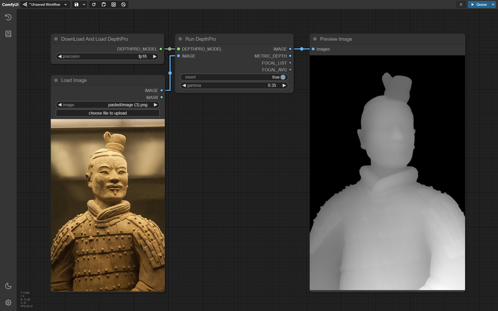

# ComfyUI DepthPro

> This is a fork of the repository `https://github.com/spacepxl/ComfyUI-Depth-Pro` to which I've tried to bring improvements.

Custom ComfyUI nodes to run DepthPro models. Supported versions:

- Hugging Face: [apple/DepthPro](https://huggingface.co/apple/DepthPro)
- Github: [apple/ml-depth-pro](https://github.com/apple/ml-depth-pro)

## Getting Started

Go to the ComfyUI folder `.\ComfyUI\custom_nodes`, clone this repository and install Python dependencies:

```sh
# Clone repo
git clone https://github.com/alexisrolland/ComfyUI-DepthPro.git

# Install dependencies
..\..\python_embeded\python.exe -s -m pip install -r .\ComfyUI-DepthPro\requirements.txt
```

## Example



## Remarks

The raw output of the depth model is metric depth (aka, distance from camera in meters) which may have values up in the hundreds or thousands for far away objects. This is great for projection to 3d, and you can use the focal length estimate to make a camera (focal_mm = focal_px * sensor_mm / sensor_px)

If you get errors about "vit_large_patch14_dinov2" make sure timm is up to date (tested with 0.9.16 and 1.0.9)

The "DownLoad And Load DepthPro" node will automatically download the model from Hugging Face, but if you want to manually download it, you can download it [from here](https://huggingface.co/spacepxl/ml-depth-pro/blob/main/depth_pro.fp16.safetensors) and place it in `ComfyUI/models/depth/ml-depth-pro/`


## License

All code that is unique to this repository is covered by the Apache-2.0 license. Any code and models that are redistributed without modification from the original codebase may be subject to the original license from https://github.com/apple/ml-depth-pro/blob/main/LICENSE if applicable. This project is not affiliated in any way with Apple Inc.
